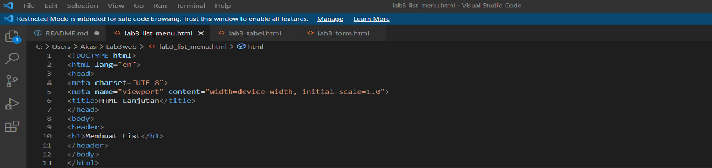

# Lab3web
## belajar membuat html lanjutan

### membuat tabel from dan list menu
1. Tugas
Buatlah form yang menampilkan dropdown menu dan listbox dengan multiple selection.

Untuk membuat dropdown dan listbox saya menggunakan element <select> untuk menampilkan dropdown dan listbox.

1. praktik nya
membuat dokumen HTML terlebih dahulu,

Hasil dari program

! [gambar 2](screenshot/ss4.png)